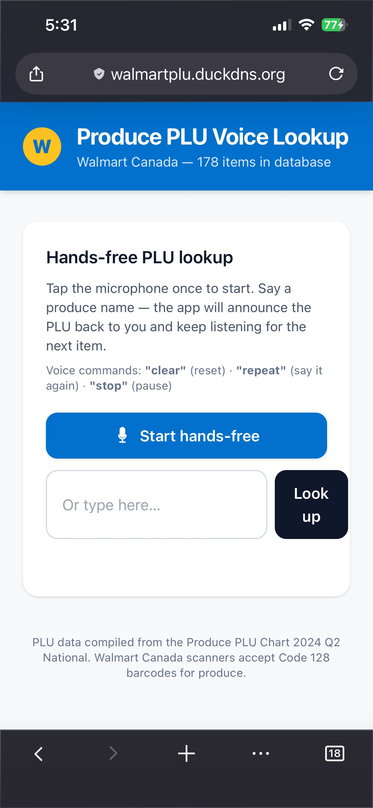
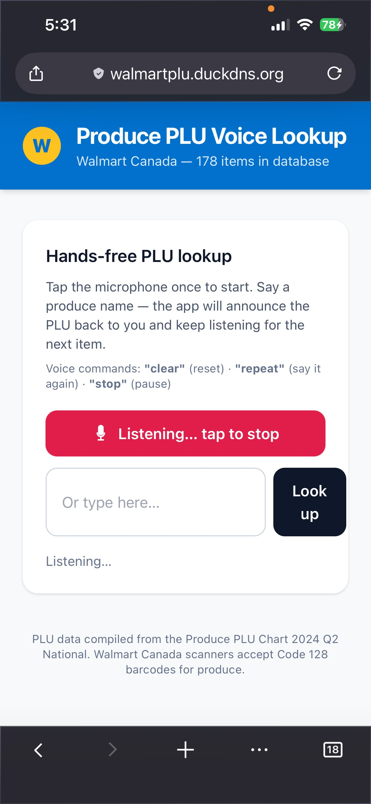
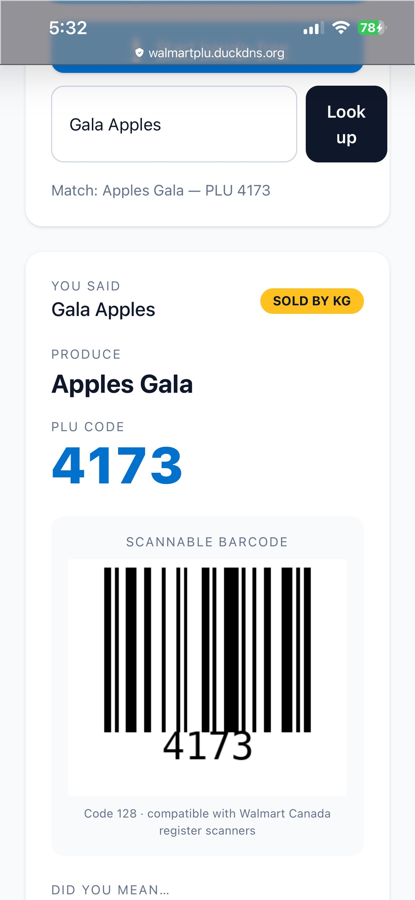

# Walmart Canada Produce PLU Voice Lookup

Hands-free produce PLU lookup for Walmart Canada. Say or type a produce item, get the matching PLU, and display a scannable Code 128 barcode.

[Link to website.](https://walmartplu.duckdns.org/)

## Screenshots

| Home | Voice lookup | Barcode result |
| --- | --- | --- |
|  |  |  |

## Features

- Voice-first lookup using the Web Speech API (`en-CA`)
- Fuzzy search across produce names and aliases
- Code 128 barcode generation for fast register scanning
- Hands-free flow with spoken PLU readback
- Type-to-search fallback for browsers without speech recognition

## Tech Stack

- **Backend:** Flask, `python-barcode`, Pillow
- **Frontend:** Jinja2, Tailwind CSS, TypeScript
- **Testing:** pytest, Playwright
- **Deploy:** Gunicorn-ready Flask app with Docker and Caddy config

## Data

`data/plu_data.json` is transcribed from the Dept. 94 Produce PLU Chart - 2025 Q4 (National). Each entry includes:

- `plu`: numeric PLU or item code
- `unit`: `KG` or `EA`
- `name`: display name
- `aliases`: searchable alternate names

## Local Setup

```bash
python3 -m venv .venv
source .venv/bin/activate
pip install -r requirements-dev.txt
npm install
npm run build
python app.py
```

Open `http://127.0.0.1:5000`.

## Testing

```bash
python3 -m pytest
```

## API

- `GET /api/lookup?q=<item>` returns the best match plus alternatives.
- `GET /api/barcode/<plu>.png` returns a Code 128 barcode image.
- `GET /api/all` returns the full PLU dataset.

### License 

This project is licensed under the PolyForm Noncommercial License 1.0.0 — see the LICENSE file for details.
